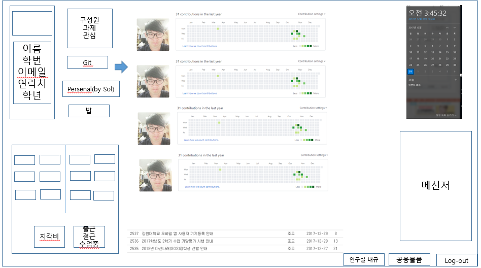

# 연구실 관리 프로그램

## 전인준
### 전체설계

#### Leader
#### Member
- Todo list
- Time schedule
- Money

신상정보
이름
컴퓨터
	모니터
	RAM
CPU
HDD
SDD
발표일
학점평균
		상세보기
		학부
		석사
		박사
가능 언어
	C
C++
C#
Python
Java
	좌우명
	입사동기
	흥미분야

회식

놀이
모두의 마블
	인형뽑기

연구비 총액

#이원준

### 연구실가계부

#### Display

1.가계부확인
2.가계부추가

(1)
번호/이름/입출금/내용분류/금액/날짜/시간/개인잔액/총잔액/비고

(2-0)
이름 :
1. 이원준
2. 임하슬린

금액 : UM원

입출금
1. 입금
2. 출금

사용방법
1. 비품
2. 회식
3. 기타

비고 : x

****
#### Data
int AM  // 총 잔액
int 1M  // 이원준 잔액
int 2M  // 임하슬린 잔액
int UM // 사용금액
string x // 비고

#### Function
func0 : AM = M+-UM;
func1 : 1M = M+-UM;
func2 : 2M = M+-UM;

## 안해린
연구실 인원 관리부 요구사항
-이름
-학번
-등록일
-분류: 학/석/박사
-전체 인원

#Display
1. 명단
2. 신규
3. 수정
4. 삭제
0. 종료

명단

신규
1. 이름
2. 학번
3. 분류

수정 : 학번 검색해서
1. 이름
2. 학번
3. 분류

삭제 : 학번 검색해서

////***8
#Data
char name //학생이름
int num //학번
char grade //분류
int total //총 학생 수

#Function
find : find students strcmp()
delete : delete students , num--;
insert : insert students , num++;
change : change student info
print : print all students info

## 임하슬린
비품관리 프로그램 요구사항
- 학생 이름
- 비품 수량(비품은 일단 컴퓨터 프린터 키보드로한정)
- 등록일
비품관리 시스템 -----------------------------
1. 입력 2. 전체출력 3. 조회 4. 끝내기 
------------------------------
1. 입력
이름 
날짜 
컴퓨터 개수
프린터 개수
키보드 개수
----------------------------------------
#Data  
int no;//순번
char ob_name[10];//학생이름
char date[6];// 등록날짜
int computer, printer, keyboard;// 비품
#Function
void input(OB test[]);// 비품목록추가
void output_element(OB e);// 하나의 원소만 출력
void output_list(OB test[]);// 배열 모두출력
void print_title();// 데이터내용의 제목출력
void search(OB test[]);// 이름 검색
